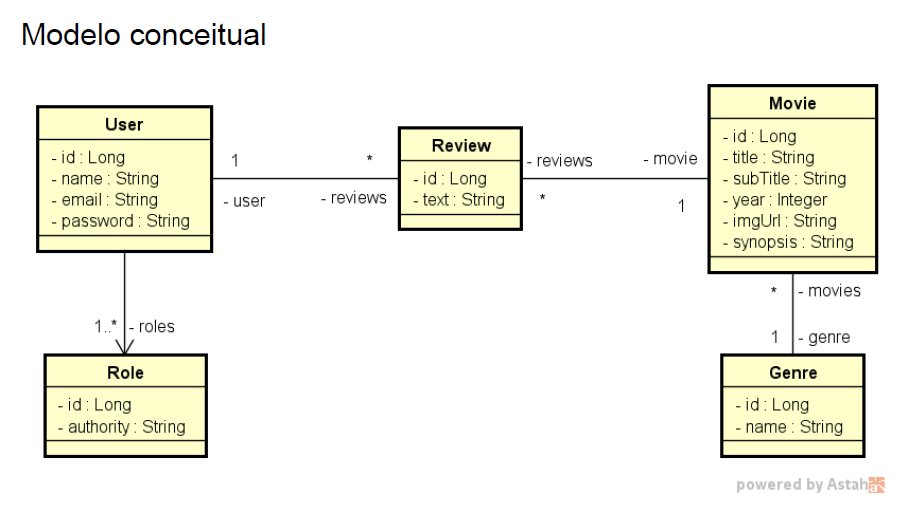

<div align="left">
  <h1><strong>Movieflix</strong></h1>
</div>

## Índice

- [Sobre](#sobre)
- [Casos de uso](#casos-de-uso)
- [Como executar o projeto](#como-executar-o-projeto)
- [Tecnologias Utilizadas](#tecnologias-utilizadas)
- [Como Contribuir](#como-contribuir)

## Sobre

Este é um sistema de listagem de filmes, seus gêneros e as reviews destes filmes.

<div align="center">
  
</div>

A especificação do que foi implementado está no próprio código fonte dos testes automatizados.


[Voltar ao Índice](#índice)

## Casos de Uso

### Listar filmes:
1. [OUT] O sistema apresenta uma listagem dos nomes de todos gêneros, bem como uma
      listagem paginada com título, subtítulo, ano e imagem dos filmes, ordenada
      alfabeticamente por título.
2. [IN] O usuário visitante ou membro seleciona, opcionalmente, um gênero.
3. [OUT] O sistema apresenta a listagem atualizada, restringindo somente ao gênero
   selecionado.

### Visualizar detalhes do filme:
1. [IN] O usuário visitante ou membro seleciona um filme
   https://devsuperior.com.br
2. [OUT] O sistema informa título, subtítulo, ano, imagem e sinopse do filme, e também
   uma listagem dos textos das avaliações daquele filme juntamente com nome do usuário
   que fez cada avaliação.
3. [IN] O usuário membro informa, opcionalmente, um texto para avaliação do filme.
4. [OUT] O sistema apresenta os dados atualizados, já aparecendo também a avaliação
   feita pelo usuário.

[Voltar ao Índice](#índice)


## Como executar o projeto

1. Clonar o projeto a partir do GitHub

   ````https://github.com/felipeam10/Movieflix````

2. Em sua IDE de preferência, abra o projeto a partir do diretório que o mesmo foi clonado. 

3. Importe as Collections do postman a partir do caminho: ````src/main/resources/postmanFiles````

[Voltar ao Índice](#índice)


## Tecnologias Utilizadas

Antes de iniciar, assegure-se de ter o ambiente Java corretamente configurado em sua máquina. Abaixo você tem a relação das tecnologias que foram utilizadas no processo de desenvolvimento do projeto.

| Tecnologia                  | Versão                                     |
| --------------------------- |--------------------------------------------|
| Sistema Operacional         | Windows 10                                 |
| Linguagem de Programação (JDK) | java 17.0.7 2023-04-18 LTS                 
| Framework                   | Spring Boot 3.1.10                         |
| Banco de Dados              | H2 Database                                |
| IDE                         | IntelliJ IDEA 2023.1.1 (Community Edition) |
| Ferramenta de Teste de API  | Postman v10.17.4                           |

[Voltar ao Índice](#índice)

## Contribuições 

Caso tenha uma contribuição que possa melhorar este projeto, por favor, abra uma issue ou um pull request, seguindo os passos abaixo.

1. Crie um 'Fork' do projeto
2. Crie uma 'Branch' para sua modificação (`git checkout -b feature/yourFeatureName`)
3. Faça o 'Commit' das suas mudanças (`git commit -m 'Add some yourFeatureName'`)
4. 'Push' para a 'Branch' (`git push origin feature/yourFeatureName`)
5. Abra uma 'Pull Request'

[Voltar ao Índice](#índice)

